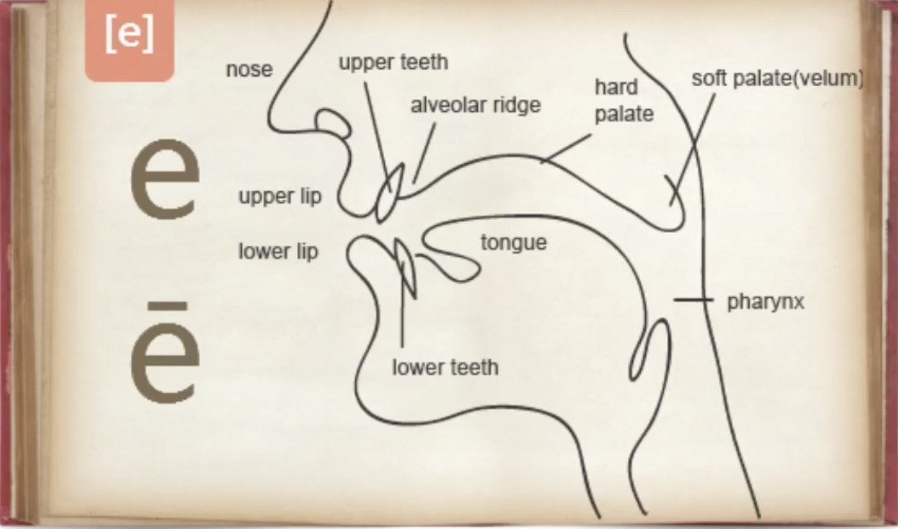
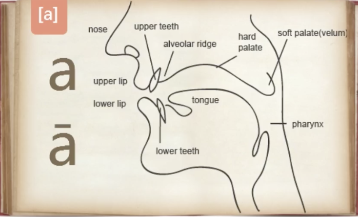
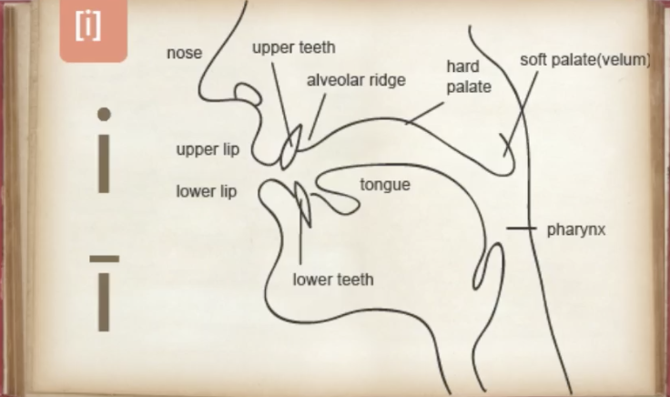
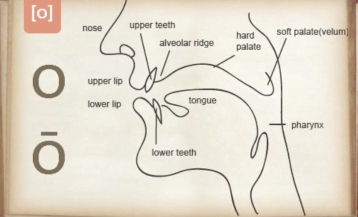
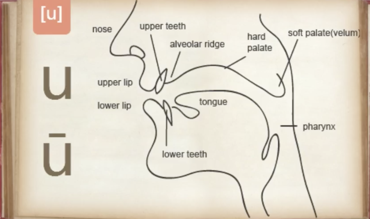

## Robin.X.Yuan Latin Note

### 拉丁语发音
- 教会式
- 古典式

这里偏重古典式

#### 1. 元音
##### 1.1 e/ē

发音图解



**例词**

et conj. 和

poēta n. 诗人

```
元音弱化现象
- 有两个音节的单词，一般重音在第一个音节上；
- 超过两个音节的单词，重音一般在倒数第二个音节上，
  若倒数第二个音节不是重音，则重音移到倒数第三个音节上；
- 非重音的音节，会出现元音弱化现象
对于poēta，由于重音在倒数第二个音节上，因而出现元音o弱化
```
**六音步诗**
metre - metrum
```
重音
1. 双元音；
2. 长音
3. 两个辅音前的元音；
4. 双辅音前的元音是重音；
5. 长音一定是重音，但是重音不一定是长音。
```

##### 1.2 a/ā


**例词**

ad conj. 到，从某处到某处

nātūra n. 自然

##### 1.3 i/ī


**例词**

silva n. 森林

Penn**sylva**nia

vīta n. 生命

##### 1.4 o/ō


**例词**

bonus adj. 好的

dō vt. 给

##### 1.5 u/ū


**例词**

ubi adv. 哪里

ūnus adj. 一，仅有

#### 2.双元音

Ipsa scientia potestas est  -- Bacon

- est 是。第三人称单数，现在时，指示语气，主动形。
- ipsa 本身。 主格，代表其他主格词。
- scientia 知识。 阴性，单数，主格。
- potestas 力量。 阴性，单数，主格。

拉丁语句子中语序灵活，大多数动词置于词末。动词移动到句中亦可。

例如：Gutta cavat lapidem. 滴水穿石

cavat在句中。

##### ae
发音技巧：“爱”
poēta 诗人 -> poēta 诗人的

以a结尾的名词，多数属于第一类名词，其属格即在a后加e。

##### au

发音技巧：“嗷”

- laudō v. 赞扬
- nauta n. 水手
##### ei

发音技巧：e和i连续

ei 感叹词 惊讶
##### eu

deus n. 上帝

##### oe
poena n. 惩罚

##### ui
和法语中的oui一样

quid 什么，怎样，为什么

**特殊规则**

如果两个单元音连在一起，其中一个是长音，则需要分开读

**特殊元音**
y 只做元音用
y 只在希腊语来的外来词中出现

发音技巧：用u的圆嘴型发i的音

### 课外单词补充
#### 法学

| Latin | La-Ch  |   En-Ch   |
|:------|:---------|:--------|
| alibi |另一个地方 | 不在场证明 |
| habeas corpus | 你可以有这个身体 | 人身保护权（嫌疑犯上法庭的权力）|
| sub-poena | poena惩罚；sub在……之下 | 传票；用（传票）传唤|

### 咒语
1. Expecto Patronum 呼神护卫

    **expecto** 

    动词第一人称单数，现在时，指示语气，主动形

    我期待，我盼望

    **patronum**

    动词宾格，单数，阳性

    守护神

2. Expelliarmus 除你武器

    **expelli**

    动词现在时的被动形不定式

    被驱逐，被除去

    **armus**

    名词，单数，阳性

    手臂
   
3. Wingardium Leviosa

此咒语借鉴拉丁语外的其他语言

例如：Avada Kedavra  阿瓦达索命

Avada Kedavra 我说，毁灭

语源：阿拉米语 abracadabra：我说，创造

Wingardium = wing(翅膀，英语) + arduus(高的、陡峭的，拉丁语)

Leviosa：拉丁语levo演变而来 -> 升起


ĀŌĪĒŪāīū
